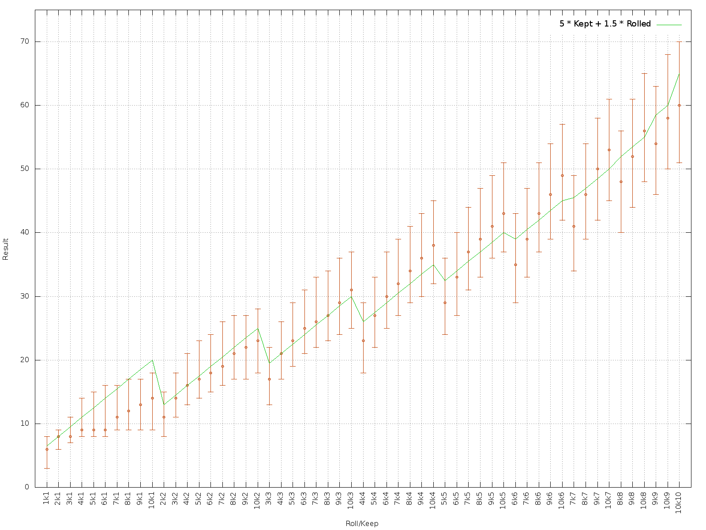
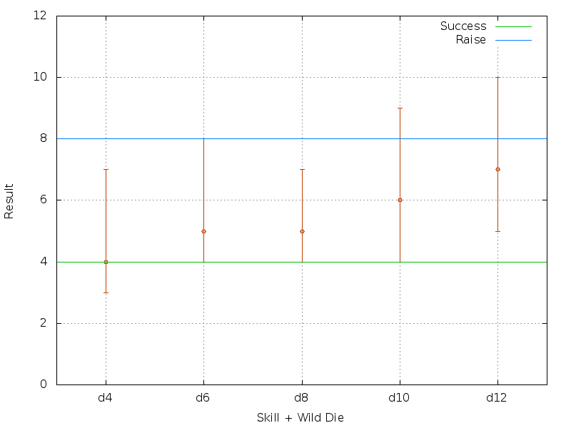

# Gaming

This repo contains some simple scripts that I've found useful for generating plots to better understand the dice probabilities for several gaming systems.

## Roll/Keep
Here's a simple plot of the roll/keep die probabilities for the Roll/Keep mechanic used in L5R and a few other systems.

A conservative estimate is (Rolled * 5) + Kept.

## Savage Worlds

Here's a Savage World's die plot - Wild Card die is a d6.

