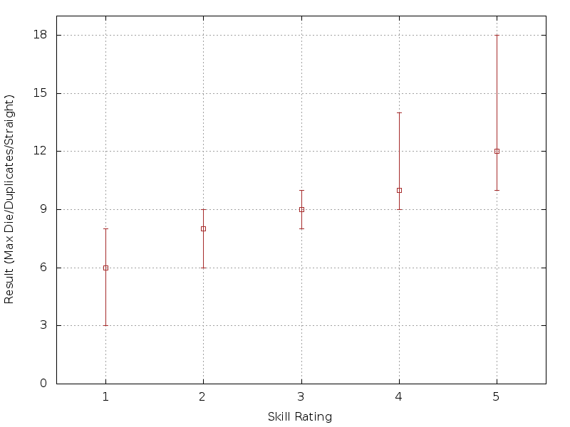

# Gaming

This repo contains some simple scripts that I've found useful for generating plots to better understand the dice probabilities for several gaming systems.  Each outputs the 25%/Median/75% roll value ranges.

## Roll/Keep
Here's a simplified plot of the die probabilities for the Roll/Keep mechanic used in L5R and a few other systems.

A conservative estimate is (Kept * 5) + Rolled.

## Savage Worlds

A Savage World's die plot - Wild Card die is a d6.

Notice that moving from a d6 to a d8 isn't really an upgrade.  I didn't plot this but if you upgrade your wild die to a d8 it essentially behaves like a +1 to all the averages.

## Framewerk

This is represents the skill roll ranges for the Framewerk RPG system (v2).

